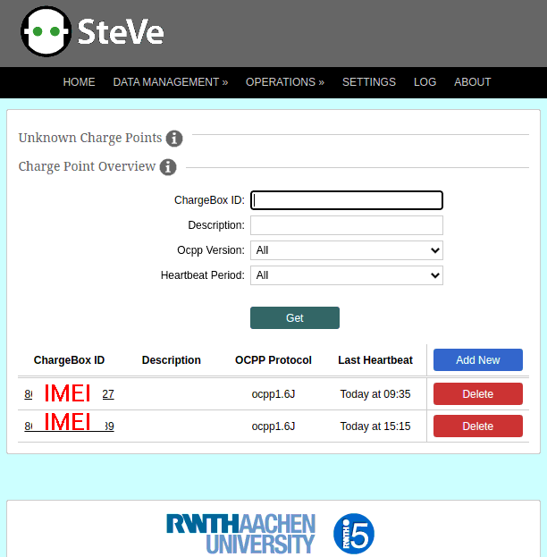

# Small-OCPP-1.6
Open Charge Point Protocol (OCPP 1.6J) client for MCUs with low RAM (AVR/ATMEGA, MCS-51 &amp; etc)

The client allows you to create cheap charging stations for electric vehicles based on the small chip ATMEGA64 and SIM800 cellular communication module and compatible.
SSL encryption is provided by the cellular module.

The project is not ready. If you are interested in the concept, please email ocpp@arduino.uno

